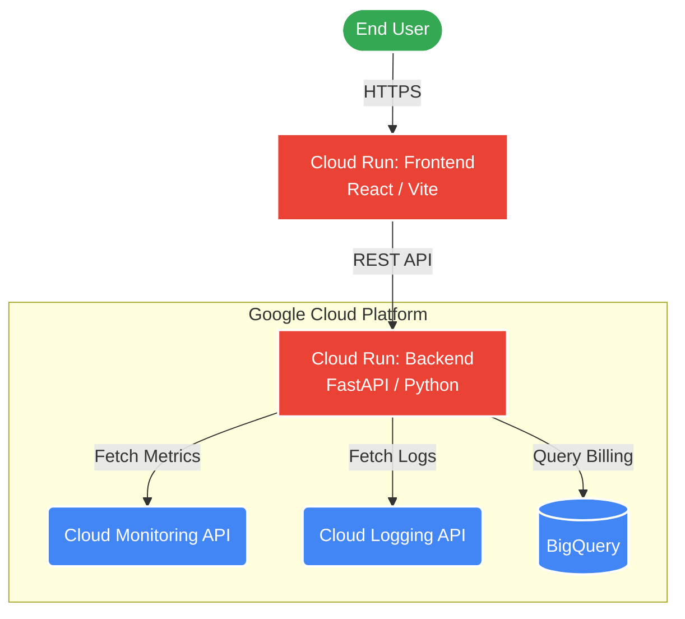
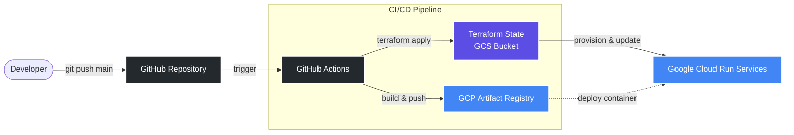

# CloudLens: GCP Infrastructure Monitoring Dashboard

CloudLens is a comprehensive, full-stack dashboard designed to monitor your Google Cloud Platform (GCP) infrastructure. It provides real-time insights into VM performance, log analysis, billing exports, and more, all within a beautiful, dynamic user interface.

## Architecture



CloudLens consists of two main components:
- **Backend**: A robust REST API built with Python and FastAPI. It integrates directly with Google Cloud SDKs to fetch monitoring metrics, logs, and billing data via BigQuery.
- **Frontend**: A modern, responsive web application built with React, Vite, and Tailwind CSS. It uses Recharts for dynamic data visualization.

## Prerequisites

Before running the project, ensure you have the following installed:
- [Docker](https://docs.docker.com/get-docker/) & [Docker Compose](https://docs.docker.com/compose/install/)
- A Google Cloud Platform account with the following APIs enabled:
  - Compute Engine API
  - Cloud Monitoring API
  - Cloud Logging API
  - BigQuery API (for billing export data)

## Local Development Setup

To run CloudLens locally using Docker Compose:

1. **Clone the repository:**
   ```bash
   git clone <repository-url>
   cd CloudLens
   ```

2. **Set up GCP Credentials:**
   Create a Service Account in your GCP project with the necessary roles (e.g., `Monitoring Viewer`, `Logs Viewer`, `BigQuery Data Viewer`, `BigQuery Job User`). Generate a JSON key for this service account and save it as `sa-key.json` in the `backend/` directory.

3. **Configure Environment Variables:**
   Copy the example environment file in the backend directory:
   ```bash
   cp backend/.env.example backend/.env
   ```
   Open `backend/.env` and update the values with your GCP Project ID and Region:
   ```env
   GCP_PROJECT_ID=your-gcp-project-id
   GCP_REGION=us-central1
   GOOGLE_APPLICATION_CREDENTIALS=/app/sa-key.json
   ```

4. **Start the application:**
   Use Docker Compose to build and start both the frontend and backend services:
   ```bash
   docker-compose up --build
   ```

5. **Access the application:**
   - **Frontend Dashboard**: Open your browser and navigate to `http://localhost:3000`
   - **Backend API Documentation**: Open your browser and navigate to `http://localhost:8000/docs`

## Deployment

CloudLens is configured for automated deployment to **Google Cloud Run** using Terraform and GitHub Actions.



### Step 1: Prepare Terraform State Bucket
Before the CI/CD pipeline can run, you must create a Google Cloud Storage (GCS) bucket to store the Terraform state. 
Run this command in your terminal (using `gcloud` CLI), replacing `<YOUR_BUCKET_NAME>` with a globally unique name:
```bash
gcloud storage buckets create gs://<YOUR_BUCKET_NAME> --location=us-central1
```
Next, update the `terraform/backend.tf` file with your new bucket name.

### Step 2: Configure GitHub Secrets
For the GitHub Actions pipeline to deploy your infrastructure, you need to provide it with a GCP Service Account key.
1. Go to your GitHub repository settings -> **Secrets and variables** -> **Actions**.
2. Create a new repository secret named `GCP_SA_KEY`.
3. Paste the contents of a GCP Service Account JSON key that has the `Owner` or `Editor` role on your project (required to create Artifact Registry and Cloud Run services).

### Step 3: Trigger the Pipeline
The CI/CD pipeline is configured to run automatically when code is pushed to the `main` branch. 
The pipeline will:
1. Provision a Google Artifact Registry repository via Terraform.
2. Build Docker images for both the frontend and backend.
3. Push the images to Artifact Registry.
4. Deploy the images to scalable Google Cloud Run services via Terraform.

Once the pipeline completes, the final Cloud Run URLs for your frontend and backend will be available in the GitHub Actions Terraform step output.
